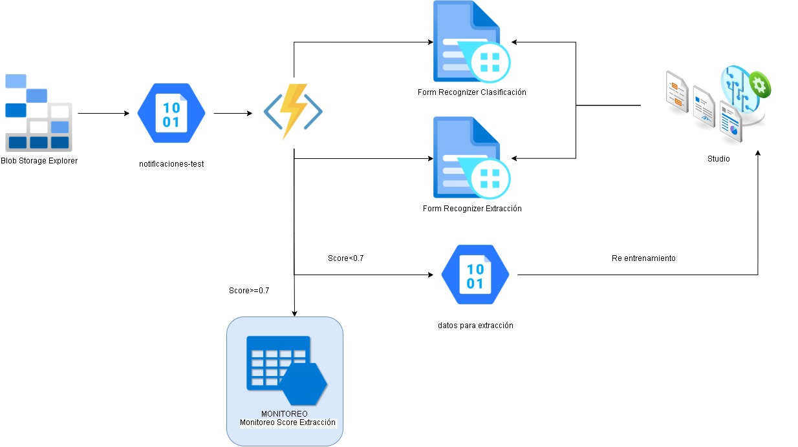

# Identificar documentos tipo notificaciones y extraer información del notificado con Form Recognizer 

_Esta función de Azure funciona cómo un gateway que se activa con un trigger cuando existe un documento nuevo en el blob storage, y envía el documento a Form Recognizer para ser analizado_

Se utilizan dos modelos cognitivos:

1. Un modelo para clasificar un documento de notificación
2. Un modelo para extraer la información de una notificación


### Arquitectura



## Comenzando 🚀

el proyecto se encuentra alojado en el repositorio API-Documento-Notificacion Equipo ExperimentacionIA

_Estas instrucciones te permitirán obtener una copia del proyecto en funcionamiento en tu máquina local para propósitos de desarrollo y pruebas._

```
git clone https://esto es un ejemplo
```

Mira **Deployment** para conocer como desplegar el proyecto.


### Pre-requisitos 📋

_Que cosas necesitas para instalar el software y como instalarlas_

_Instalación de librerías y requerimientos_

```
pip install -r requirements.txt
```

### Instalación en Azure Functión⚡

_instalar azure function en visual studio code_

_descargarlo en_

```
https://marketplace.visualstudio.com/items?itemName=ms-azuretools.vscode-azurefunctions
```

_ejecutar el código_

```
func host start
```

## Variables de entorno

para probarla de forma local se configura el archivo **local.setting.json**, desplegado se configura en **configuraciones** de azure function

```json
    "AzureWebJobsStorage": String de conexión al Azure Storage
    "FUNCTIONS_WORKER_RUNTIME": "python",
    "stsentencias_STORAGE": String de conexión al Azure Storage
    "TABLE_NAME":"notificacionesValoresExtraidos", Tabla donde guardamos la información extraida
    "MODEL_ID_CLASIFICADOR":"notificaciones_clasificacion",
    "MODEL_ID_EXTRACCION": "notificaciones_extraer_informacion",
    "ENDPOINT":"https://endpoint.cognitiveservices.azure.com/", Endpoint del Cognitive Service
    "AZURE_CREDENTIAL": Credenciales del Cognitive Service
    "SCORE_VALIDAR":0.7, Score para validar los resultados de Form Recognizer
    "CONNECTION_STRING": String de conexión al Azure Storage
    "NUMERO_ETIQUETAS_VALIDACION":1, Número de etiquetas a encontrar para validar la notificación
```

## Ejecutando las pruebas ⚙️

_Explica como ejecutar las pruebas automatizadas para este sistema_

### Analice las pruebas end-to-end 🔩

_Explica que verifican estas pruebas y por qué_

cargar los documentos en el contenedor

```
notificaciones test
```

de la storage account

```
stsentencias
```

del grupo de recursos
```
documentoscategorizados
```


## Despliegue 📦

El despliegue se realizó utilizando la extensión de Visual Studio Code Azure Function Tools
con las opciones:


## Construido con 🛠️

_Menciona las herramientas que utilizaste para crear tu proyecto_

* [Form Recognizer Studio ](https://formrecognizer.appliedai.azure.com/studio) - su versión BETA 3.2.0b4
* [Azure Function](https://docs.microsoft.com/en-us/azure/azure-functions/#:~:text=Azure%20Functions%20is%20a%20cloud,provides%20serverless%20compute%20for%20Azure.) Despliegue del código
* [Storage Account](https://docs.microsoft.com/en-us/azure/storage/common/storage-account-overview) - Almacenamiento de datos
* [Python](https://www.python.org/) - 3.7

## Contribuyendo 🖇️

Por favor lee el [CONTRIBUTING.md](https://gist.github.com/villanuevand/xxxxxx) para detalles de nuestro código de conducta, y el proceso para enviarnos pull requests.

## Wiki 📖

Puedes encontrar mucho más de cómo utilizar este proyecto en nuestra [Wiki](https://fecork.notion.site/Memorias-Identificar-documentos-tipo-notificaciones-y-extraer-informaci-n-del-notificado-con-Form-R-b059e17f6195435a81e9d41de99cefab)

## Versionado 📌

Usamos [SemVer](http://semver.org/) para el versionado. Para todas las versiones disponibles, mira los [tags en este repositorio](https://github.com/tu/proyecto/tags).

## Autores ✒️

_Menciona a todos aquellos que ayudaron a levantar el proyecto desde sus inicios_

- **Ferney Córdoba Canchala** - _Msc AI_ - [LinkedIn](https://www.linkedin.com/in/wilberth-ferney-córdoba-canchala-9734b74b/)
 

## Licencia 📄

Este proyecto está bajo la Licencia (Tu Licencia) - mira el archivo [LICENSE.md](LICENSE.md) para detalles

## Expresiones de Gratitud 🎁

* Comenta a otros sobre este proyecto 📢
* Invita una cerveza 🍺 o un café ☕ a alguien del equipo. 
* Da las gracias públicamente 🤓.
* etc.